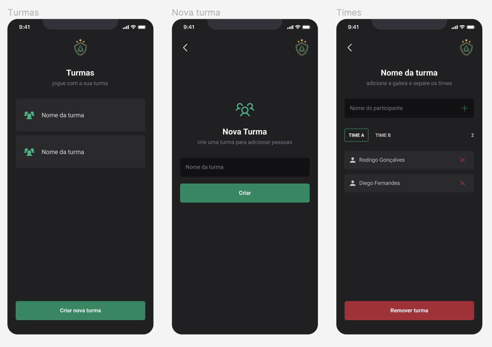

# igniteTeams

Aplicação desenvolvida com o propósito de ajudar a organizar pessoas que se reúnem para jogar em turmas. Aplicativo desenvolvido em React Native do Bootcamp Ignite da Rocketseat.

Tecnologias utilizadas:

- [x] Expo
- [x] Typescript
- [x] AsyncStorage
- [x] Phosphor React Native
- [x] React Native Safe Area Context
- [x] React Native Navigation
- [x] Styled Components

